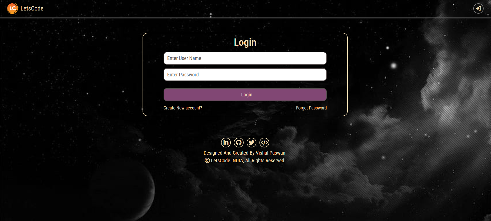
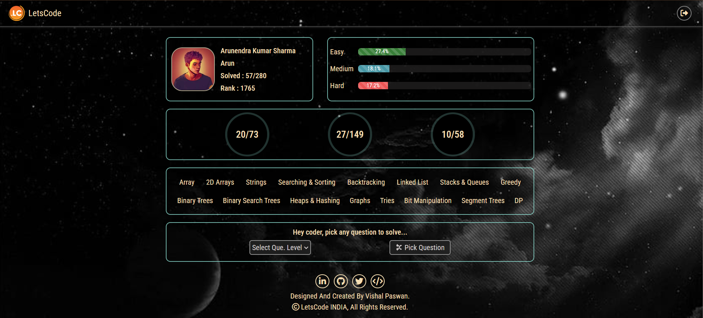

# LetsCode is a coding platform for DSA practice.

This is an **Let's Code** web application built using these **(MongoDB, Express, EJS, Node.js)** technology. The website is designed to help coders to solve and practice DSA problems. It consists of most frequently asked DSA questions in coding round.

## Features
- **User Authentication**: Users can sign up, log in, and manage their accounts.
- **Problem Solving**: Users can access a variety of DSA problems, categorized by difficulty (Easy, Medium, Hard).
- **Track Progress**: Users can track their solved questions and the percentage of questions solved across different categories.
- **Ranking System**: A ranking system that ranks users based on the number of solved problems.
- **Responsive Design**: The application is fully responsive and works well on mobile and desktop devices.

## Technologies Used
- **MongoDB**: Database to store attendance records and user data (students and teachers).
- **Express.js**: Web framework to handle API routes.
- **EJS**: Frontend framework to build the user interface.
- **Node.js**: JavaScript runtime to run the server-side code.
- **Mongoose**: ODM for MongoDB to interact with the database.
- **Passport.js**: Authentication middleware for handling user login and sign-up.
- **CSS**: For styling the frontend, including responsive design.
- **Render**: Hosting platform for deploying the application.

## Live Project Link
[Live Project - Let's Code](https://letscode-vxit.onrender.com)

## Website images

### Home page


### User page


### Question page


### Random question page


## Installation

### Prerequisites

- Node.js installed.
- MongoDB running (locally or using a cloud provider like MongoDB Atlas).
- A code editor like **VS Code** for editing the project files.

### Steps

1. **Clone the repository:**

    ```bash
    git clone https://github.com/VishalPaswan2402/LetsCode.git
    cd LetsCode
    ```

2. **Install backend dependencies:**

    ```bash
    npm install
    ```

3. **Set up environment variables:**

    Create a `.env` file in the backend directory and add your credentials:

    ```bash
    MONGODB_URL=your_database_url
    SECREAT_PASS=your_website_secret_pass
    EMAIL_PASS=your_email_password
    EMAIL_USER=your_email_user
    EMAIL_HOST=your_email_host
    ```

4. **Start the server:**

    ```bash
    node index.js
    ```

10. **Running the server:**
    - The server will be running on `http://localhost:8080`.

## Advantages of LetsCode

- **Comprehensive DSA Practice**: LetsCode provides a wide range of Data Structures and Algorithms problems, categorized by difficulty (Easy, Medium, Hard). This allows users to practice and enhance their problem-solving skills across multiple levels of complexity.

- **Track Your Progress**: Users can track their progress in real-time, including the number of solved problems, and the overall percentage of problems solved. This helps to maintain motivation and ensures users can monitor their improvement.

- **Leaderboard and Rankings**: The ranking system encourages friendly competition among users. By solving more problems, users improve their rankings and compete with others, creating a sense of accomplishment and gamification.

- **User-friendly Interface**: The platform is designed with a clean and intuitive interface, ensuring a smooth experience for both beginners and advanced users. It’s easy to navigate through the problems and check progress.

- **Responsive Design**: The application is fully responsive, meaning it works seamlessly across different screen sizes—whether you're using a desktop, tablet, or mobile phone. This provides flexibility for users to practice anywhere.

- **Real-time Authentication and Security**: With passport-based authentication, LetsCode ensures secure login and account management, providing a safe platform for users to access and track their DSA progress.

- **No Cost**: LetsCode is completely free to use. Whether you're a beginner or an experienced coder, this platform provides a cost-effective solution for practicing DSA without any subscription or payment requirements.

---

 By using LetsCode, you can enhance your coding skills, track your progress, and compete with fellow users in the world of Data Structures and Algorithms.


## Signup Process - LetsCode

The signup process on LetsCode is simple and quick. Follow the steps below to create an account and start solving DSA problems:

### 1. **Visit the Signup Page**
   - Navigate to the **Signup** page from the homepage of the application.
   - You will be prompted to enter a username, email, and password to create your account.

### 2. **Enter User Details**
   - **Username**: Choose a unique username for your profile.
   - **Email**: Provide a valid email address.
   - **Password**: Create a secure password for your account. Ensure it's strong, with a mix of uppercase letters, lowercase letters, numbers, and symbols for enhanced security.

### 3. **Submit Signup Form**
   - After entering your details, click on the **Signup** button to create your account.
   - If all fields are validated successfully, your account will be created.

### 4. **Email Verification**
   - Once you submit your signup details, a verification email will be sent to your email address.
   - **Click on the verification link** in the email to confirm your registration.
   - This step ensures the authenticity of your account.

### 5. **Login to Your Account**
   - After verifying your email, you can log in using your **username** and **password**.
   - On successful login, you will be directed to the dashboard where you can start solving DSA problems, track progress, and view your rank.

---

By following these steps, you will be able to create an account on LetsCode and start practicing Data Structures and Algorithms right away. The easy signup process ensures that you can get started with no hassle, and the email verification adds an extra layer of security to your account.
